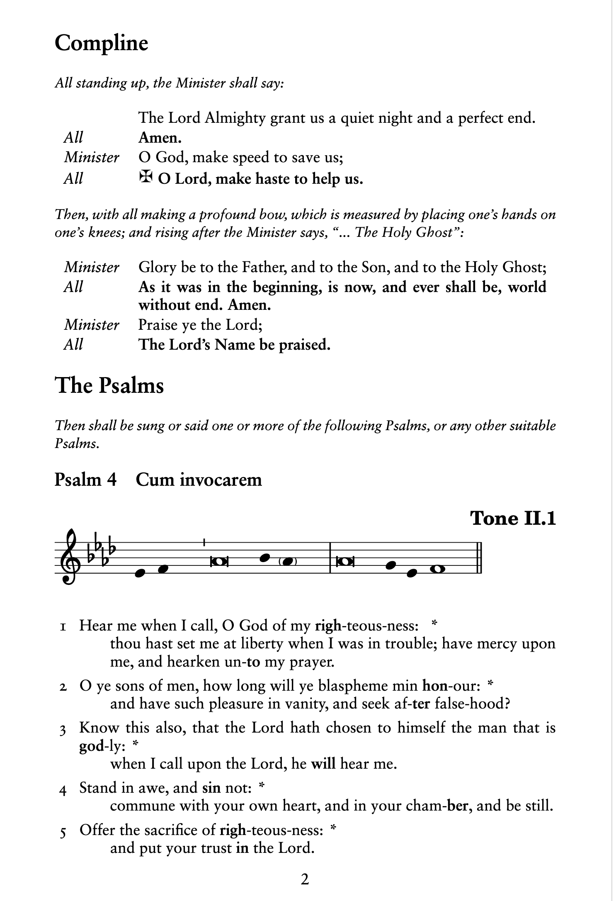

# 1962-compline

A little project writing out the service of Compline from 
the [1962 Book of Common Prayer](https://en.wikipedia.org/wiki/Book_of_Common_Prayer_(1962)).

I have also included some Marian Antiphons from the [Anglican Breviary](https://www.anglicanbreviary.net/).

# How to build

If you want to compile this yourself, I use the the following build commands:

```sh
$ ./compile-lilypond.sh # Compile the LilyPond files
$ lualatex  -synctex=1 -interaction=nonstopmode -file-line-error -recorder  "./1962-bcp-compline.tex" # Compile the latex document
```

I've been building this with the [LaTeX Workshop](https://marketplace.visualstudio.com/items?itemName=James-Yu.latex-workshop)
extension in [Vscodium](https://vscodium.com/). 

# Dependencies

I've vendorized the [`book-of-common-prayer` package](https://ctan.org/pkg/book-of-common-prayer),
please check them out!

The other major source for the text is from [Prayer Book Society of Canada](https://prayerbook.ca/),
and their PDF handout for [Compline](https://prayerbook.ca/wp-content/uploads/2021/05/bcp-1962-compline-booklet.pdf).



# TODO:

- [ ] make all music of regular size, currently just `\includegraphics[width=\textwidth]` shenanigans
- [ ] include music for marian antiphons
